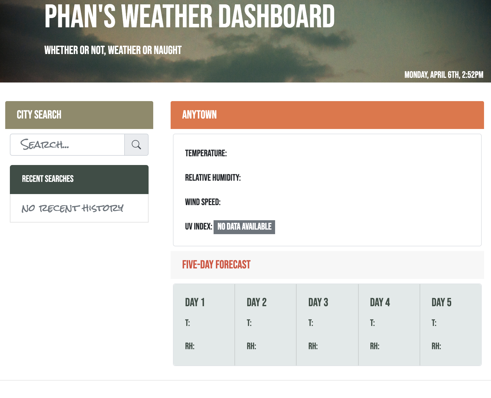
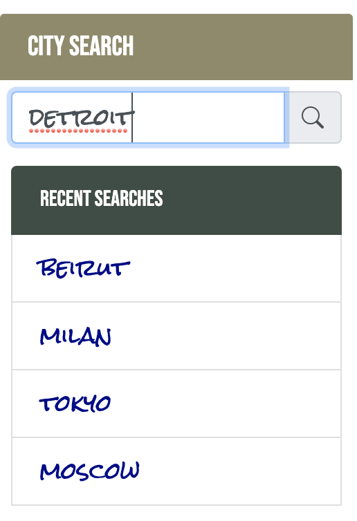
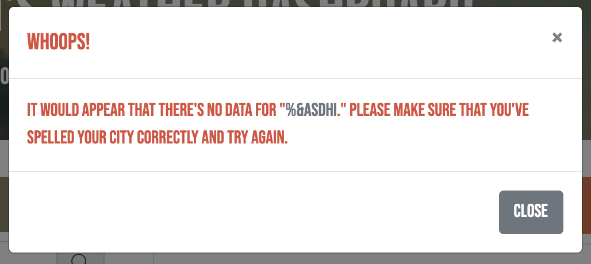
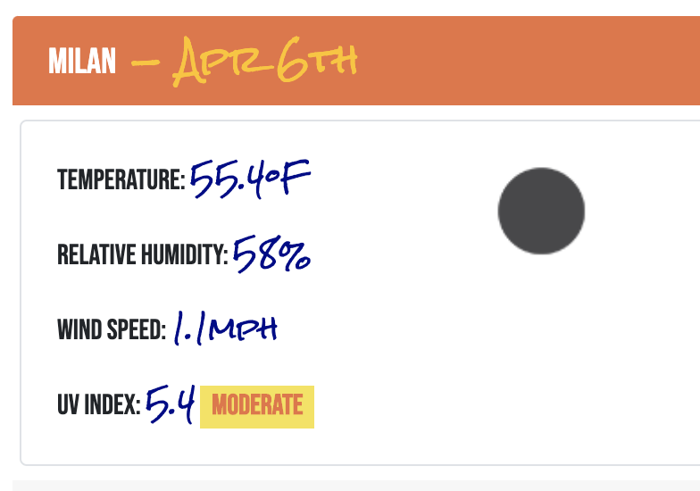
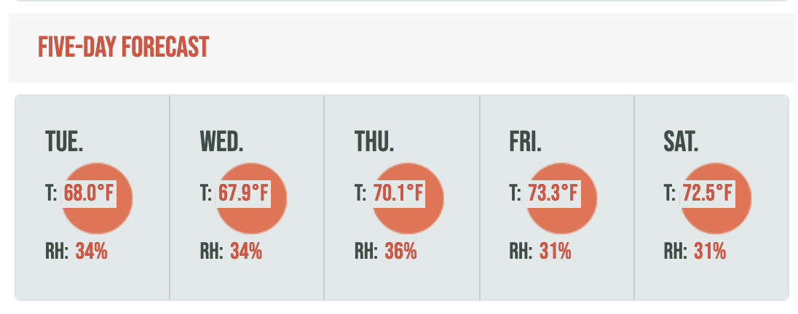
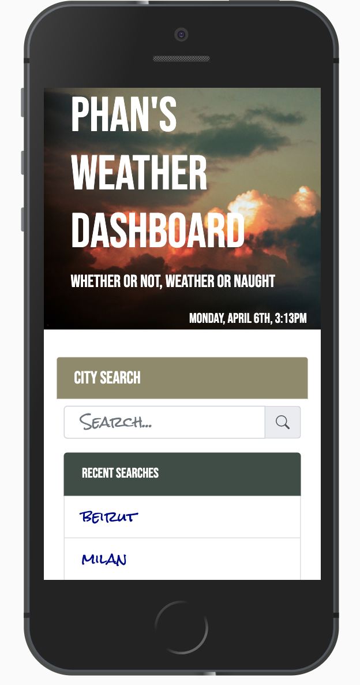

# 06 Server-Side APIs: Weather Dashboard

<!-- //PURPOSE & FUNCTIONALITY OF APPLET// -->
This applet [(click here)](https://aphan1982.github.io/homework_6/) 

enables a user to search by city name for weather data. The current local date and time are updated via `moment.js` in the jumbotron header for reference:

When the user makes a valid search entry, each search entry is dynamically listed in a history of up to ten clickable reference buttons. These entries are stored in local storage to be automatically rendered when the user refreshes the screen or returns:

If an invalid spelling or other error is entered, a modal will appear alerting the user that the request cannot be processed and to try again. The erroneous entry is removed from local storage and cleared from possible buttons to click:

Whether entered as a new search or clicked from a previous search, the current data for the city requested is displayed. This includes an icon representing the atmospheric conditions, temperature in fahrenheit, relative humidity, wind speed in miles per hour, and ultraviolet index color-coded according to the World Health Organization's color scheme:

Immediately below is a five-day forecast with all the same criteria minus wind speed and UV index:

 

The formatting of the app is meant to be optimized for mobile viewing:

